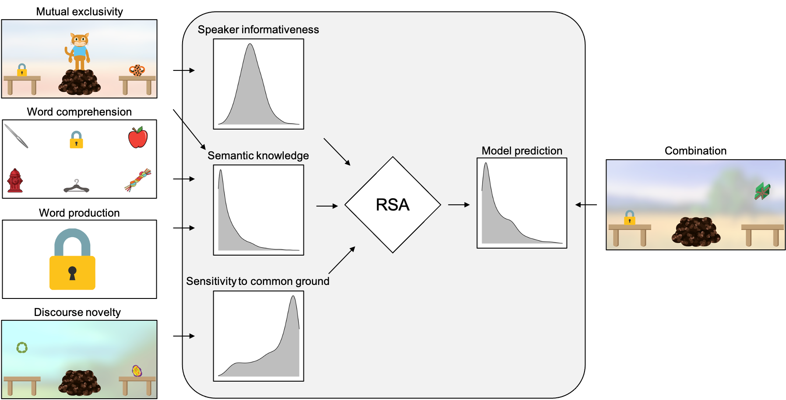
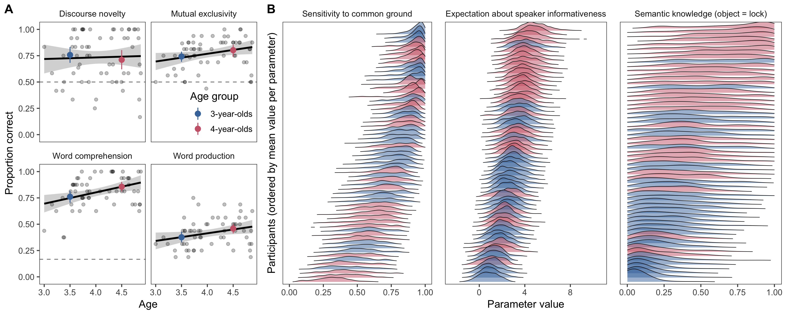
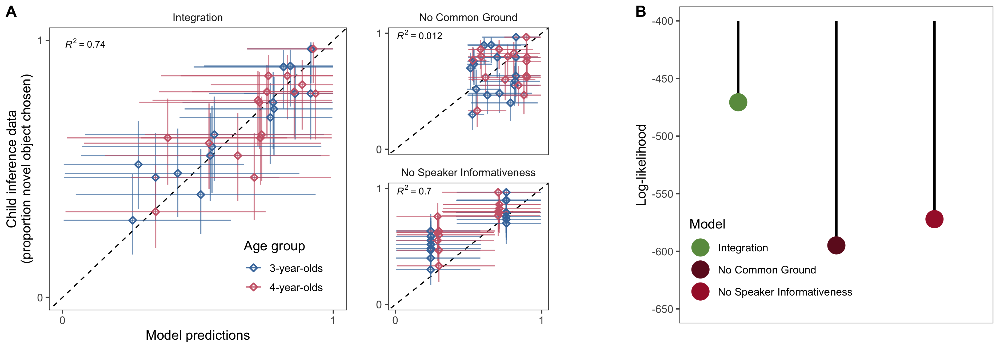
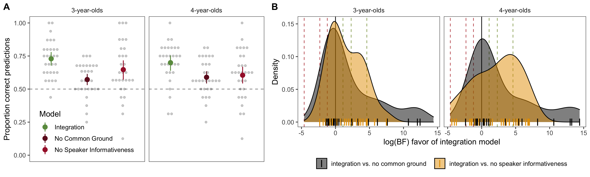

```{r setup, include = FALSE}
library(papaja)
library(tidyverse)
library(matrixStats)
library(BayesFactor)

flip <- function(x){
  coin <- sample(c(0,1), size = 1, replace = TRUE, prob = c(1 - x,x))
  return(coin)
}
```

```{r analysis-preferences}
# Seed for random number generation
set.seed(42)
knitr::opts_chunk$set(cache.extra = knitr::rand_seed)
```

```{r}
data <- read_csv("../data/merged_data.csv")
```


Cognitive models for theory building

@van2022psychological

@guest2021computational

@van2021theory

In developmental psychology

@simmering2010dialogue


@ullman2020bayesian


In pragmatic language comprehension

@bohn_tessler_merrick_frank_2019

@tessler2019language

Integrative modeling

@hofman2021integrating

Using RSA to study individual differences:

@franke2016reasoning


# Part 1: Sensitivity

## Methods

Methods, sample size and analyses were pre-registered at: https://osf.io/pa5x2. All data, analysis scripts, model code and experimental procedures are publicly available in the following online repository: https://github.com/manuelbohn/spin-within. 

### Participants

```{r}
dem <- data%>%
  distinct(subid, .keep_all = T)%>%
  summarise(n = n_distinct(subid),
            female = sum(sex == "f"),
            mage = mean(age_num),
            lrange = range(age_num)[1],
            urange = range(age_num)[2])
```
We collected complete data for `r dem%>%pull(n)` children ($m_{age}$ = `r dem%>%pull(mage)`, range$_{age}$: `r dem%>%pull(lrange)` - `r dem%>%pull(urange)`, `r dem%>%pull(female)` girls). In addition ... [Louisa - könntest Du die dropouts ergänzen, am besten auch kurz sagen warum sie drops waren]. Children came from an ethnically homogeneous, mid-size German city (~550,000 inhabitants, median income €1,974 per month as of 2020); were mostly monolingual and had mixed socioeconomic backgrounds. The study was approved by an internal ethics committee at the Max Planck Institute for Evolutionary Anthropology. Data was collected between ...[Louisa].

### Procedure

Children were recruited via a database and participated with their parents via an online conferencing tool. The different tasks were programmed as interactive picture books in `JavaScript/HTML` and presented on a website. During the video call, participants would enter the website with the different tasks and share their screen. The experimenter guided them through the procedure and told caregivers when to advance to the next task. Children responded by pointing to objects on the screen, which their caregivers would then select for them via mouse click. For the production task, the experimenter shared their screen and presented pictures in a slide show. For the mutual exclusivity, discourse novelty, and combination tasks, pre-recorded sound files were used to address the child. Figure \@ref(fig:fig1) shows screenshots from the different tasks. 

In the *discourse novelty* task, children saw a speaker (cartoon animal) standing between two tables. On one table, there was a novel object (drawn for the purpose of this study) while the other was empty. The speaker sequentially turned to both sides (order counterbalanced) and either commented on the presence or absence of an object (without using any labels). Then, the speaker disappeared and -- while the speaker was gone -- another novel object appeared on the previously empty table. Next, the speaker re-appeared and requested one of the objects using a novel non-word as the label. We assumed that children would take the novel word to refer to the object that was new to the speaker. Children received 16 trials, each with a new pair of novel objects. The location of the empty table was counterbalanced. 

In the *mutual exclusivity* task, children again saw a speaker and two tables. On one table, there was a novel object while on the other there was a (potentially) familiar object. The speaker used a novel non-word to request one of the objects.  We assumed that children would take the novel word to refer to the novel object. In line with previous work [@grassmann2015children; @bohn2021young; @lewis2020role] we assumed this inference would be modulated by children's lexical knowledge of the familiar object. Children received 16 trials, each with a new pair of novel and familiar objects. The location of the familiar object was counterbalanced. Both the discourse novelty as well as the mutual exclusivity showed good re-test reliability in a previous study and seem well-uited for individual-level measurement [@bohn2022individual].

In the *word production* task, the experimenter showed the child each of the 16 familiar objects from the mutual exclusivity task and asked them to name it. We used a pre-defined list of acceptable labels per object to categorize children's responses as either correct or incorrect.

In the *word comprehension* task, the child saw four slides with six objects. Four objects per slide were taken from the 16 familiar objects that also featured in the mutual exclusivity and word production tasks. Two objects were unrelated distractors. The experimenter labelled one familiar object after the other and asked the child to point to it. 

Data collection was split into two sessions scheduled for two consecutive?? [Louisa] days. On day one, children completed the mutual exclusivity and the discourse novelty tasks. On day two, they completed the combination task followed by the word comprehension and production tasks. 


```{r fig1, out.width="100%", fig.cap = "Schematic overview of the study and the model. Pictures on the left show screenshots from the four sensitivity tasks. Arrows indicate which tasks informed which parameter in the model (grey area). Based on the data from the sensitivity tasks, child specific parameter distributions for each information source were estimated. These sources were integrated via an RSA model, which generated predictions for each trial of the combination task. These predictions were then evaluated against new data from the combination task."}

```

## Analysis

The focus of the analysis was on estimating person-specific parameters for each inforamtion source. Models to estimate parameters were implemented in the probabilistic programming language `webppl` [@dippl]. The three information sources were: sensitivity to common ground ($\rho_i$), expectations about speaker informativeness ($\alpha_i$), and semantic knowledge ($\theta_{ij}$). Figure \@ref(fig:fig1) shows which tasks informed which parameters. All parameters were estimated via hierarchical regression (mixed-effects) models. That is, for each parameter, we estimated an intercept and slope (fixed effects) that best described the developmental trajectory for this parameter based on the available data. Participant-specific parameters values (random effects) were estimated as deviations from the value expected for a participant based on their age. Details about the estimation procedure can be found in the supplementary material. The code to run the models can be found in the associated online repository. 

The parameters for semantic knowledge ($\theta_{ij}$) were simultaneously informed by the data from the mutual exclusivity, the comprehension and the production experiments. To leverage the mutual exclusivity data, we adopted the RSA model described in Part 2 to a situation in which both objects (novel and familiar) had equal prior probability (i.e., no common ground information). In the same model, we also estimated the parameter for speaker informativeness (see below). For the comprehension experiment, we simply assumed that the child was able to select the correct word with probability $\theta_{ij}$. If the child did not know the word, we assumed they would select the correct word at a rate expected by chance (1/6). For the production experiment, we assumed that if the child knew the word (a function of $\theta_{ij}$), they produced the word with probability $\gamma$. This successful-production-probability $\gamma$ was the same for all children and was inferred based on the data. This adjustment reflects the finding that children's receptive vocabulary for nouns tends to be larger than the productive [@clark1983comprehension; @frank2021variability]. Taken together, for each child $i$ and familiar object $j$ there were three data points to inform $\theta$: one trial from the mutual exclusivity, one from the comprehension and one from the production experiment.

The parameter representing a child's expectations about how informative speakers are ($\alpha_i$), was estimated based on the data from the mutual exclusivity experiment. As mentioned above, this was done jointly with semantic knowledge in a RSA model adopted to a situation with equal prior probability of the two objects (novel and familiar). Thus, for each child, there were 16 data points to inform $\alpha$.

We estimated children's sensitivity to common ground ($\rho_i$) based on the data from the discourse novelty experiment. This was done via simple logistic regression and based on the 12 data points from this task.

## Results

Figure \@ref(fig:fig2) visualizes the results for the four sensitivity tasks and the person specific model parameters estimated from the data. In all four tasks, we saw that children performed above chance (not applicable in the case of word production), suggesting that they made the alleged pragmatic inference or knew (some) of the words for the objects involved. With respect to age, performance in raw test scores seemed to increase with age in the three tasks relying on semantic knowledge (mutual exclusivity, word production and word comprehension). Performance in these tasks was also correlated (see supplementary material). For discourse novelty, performance did not increase with age. Most importantly, however, we saw considerable variation between individuals. When focusing on the individual-specific parameter estimates (Figure \@ref(fig:fig2)B), we saw that parameters that were estimated based on more data (sensitivity to common ground -- 12 trials, and expectations about speaker informativeness -- 16 trials) had better defined posterior distributions compared to semantic knowledge (3 trials per object).   

```{r fig2, out.width="100%", fig.cap = "Results for the sensitivity tasks. A: proportion of correct responses in each task by age. Colored dots show the mean proportion of correct responses (with 95\\% CI) binned by year. Regression lines show fitted generalized linear models with 95\\% CIs. B: posterior distributions for each parameter (information source) and participant, ordered by mean value, separate for each parameter. Color shows age group."}

```

## Discussion

The goal of Part 1 was to estimate person-specific parameters representing each individual's sensitivity to the three information sources. We found that, as a group, children were sensitive to the different information sources. Furthermore, there was substantial variation between individuals in *how* sensitive they were to each information source. These results provided a solid basis for studying information integration in Part 2. 

# Part 2: Integration

In Part 2, we studied how children integrate the three information sources. We incorporated the parameters estimated in Part 1 in a computational cognitive model of pragmatic reasoning to generate participant-specific predictions about how the three information sources should be integrated. We then compared these predictions to new data collected with a task in which all three information sources were manipulated. We used Bayesian model comparisons to compare our focal *rational integration model* to alternative models that made different theoretical assumptions about the integration process. 

## Methods

The study was pre-registered and all data, analysis script and materials are publicly available (see Part 1 for more information).

### Participants

Participants were the same as in Part 1. 

### Procedure

The task was implemented in the same environment as the tasks in Part 1. Each child completed the combination task on the second testing day. The general procedure followed that of the novelty task, however, only one of the objects was unknown while the other was familiar. The combination task had two conditions. In the *congruent condition*, the object that was new to discourse was the novel object. As a consequence, mutual exclusivity and discourse inferences pointed to the same object as the referent of the novel word were aligned. In the *incongruent condition*, the familiar object was new to discourse and thus, the two inferences pointed to different objects. We created matched pairs for the 16 familiar objects and assigned one object of each pair to one of the two conditions. Thus, there were eight trials per condition in the combination task in which each trial was with a different familiar object. We counterbalanced the order of conditions and the side on which the discourse-novel object appeared. Responses were coded from a mutual exclusivity perspective (choosing novel object = 1). All children received the same order of trials. There was the option to terminate the study after 8 trials (two children).

## Analysis

We adopted the modelling framework used by @bohn2021young. Our models are situated in the Rational Speech Act (RSA) framework [@frank2012predicting; @goodman2016pragmatic]. RSA models treat language understanding as a special case of Bayesian social reasoning. A listener interprets an utterance by assuming it was produced by a cooperative speaker who has the goal to be informative. Being informative is defined as producing messages that increase the probability of the listener inferring the speaker’s intended message. The focal *rational integration* model, including all data-analytic parameters, is formally defined as: 

\begin{equation}
P_{L_1}(r \mid u; \{\rho_i, \alpha_i\, \theta_{ij}\})\propto P_{S_1}(u \mid r; \{\alpha_i, \theta_{ij}\}) \cdot P(r \mid \rho_i)
(\#eq:rsafull1)
\end{equation}

The model describes a listener ($L_1$) reasoning about the intended referent of a speaker's ($S_1$) utterance. This reasoning is contextualized by the prior probability of each referent $P(r \mid \rho_i)$. This prior probability is a function of the common ground $\rho$ shared between speaker and listener in that interacting around the objects changes the probability that they will be referred to later.

To decide between referents, the listener ($L_1$) reasons about what a rational speaker ($S_1$) would say given an intended referent. This speaker is assumed to compute the informativity for each available utterance and then choose the most informative one. The expectation of speaker informativeness may vary and is captured by the parameter $\alpha$: 

\begin{equation}
P_{S_1}(u \mid r; \{\alpha_i\, \theta_{ij}\})\propto P_{L_0}(r \mid u; \{\theta_{ij}\}) ^{\alpha_i}
(\#eq:rsafull2)
\end{equation}

The informativity of each utterance is given by imagining which referent a literal listener ($L_0$), who interprets words according to their lexicon $\mathcal{L}$, would infer upon hearing the utterance. This reasoning depends on what kind of semantic knowledge (word--object mappings, $\theta_{i,j}$) the speaker thinks the literal listener has. As noted above, for familiar objects, we take semantic knowledge to be a function of the degree-of-acquisition of the associated word.

\begin{equation}
P_{L_0}(r \mid u; \{\theta_{ij}\}) \propto \mathcal{L}(u, r \mid \theta_{ij})
(\#eq:rsafull3)
\end{equation}

This modelling framework allows us to generate predictions for each participant and trial in the combination task based on the participant-specific parameters estimated in Part 1. That is, for each combination of $\rho$, $\alpha$, and $\theta$ for participant $i$ and familiar object $j$, the model returns a distribution for the probability with which the child should choose the novel object. We contrasted the predictions made by the *rational integration* model described above to those made by two plausible alternative models which assume that children selectively ignore some of the available information sources [@gagliardi2017modeling]. These models generated predictions based on the same parameters as the *rational integration* model, the only difference lay in how the parameters were used. The *no speaker informativeness* model assumed that the speaker does not communicate in an informative way and therefore focused on the sensitivity to common ground. The *no common ground* model ignores common ground information and focused on the mutual exclusivity inference (speaker informativeness and semantic knowledge instead). A detailed description of all the models along with technical information about parameter estimation can be found in the supplementary material.

We evaluated the model predictions in two steps. First, we replicated the group-level results of @bohn2021young. That is, we compared the three models in how well they predict the data of the combination task when aggregating across individuals. For this, we correlated model predictions and the data (aggregated by trial and age group) and computed pairwise Bayes Factors based on the marginal likelihood of the data given the model. 

Second, and most importantly, we evaluated how well the model predicted performance on an *individual* level. For each trial, we converted the (continuous) probability distribution returned by the model into a binary prediction (the structure of the data) by flipping a coin with the Maximum a posteriori estimate (MAP) of the distribution as its weight. For the focal and the two alternative models, we then computed the proportion of trials for which the model predictions matched children's responses and compared them to a level expected by random guessing using a Bayesian t-test. Finally, for each child, we computed the Bayes Factor in in favor of the *rational integration* model and checked for how many children this value was above 1 (log-Bayes Factors > 0). Bayes Factors larger than 1 present evidence in favor of the *rational integration* model. We evaluated the distribution of Bayes Factors following the classification of @lee2014bayesian.

## Results

```{r}
model_comp <- readRDS("../model/output/model_comparison.rds")

logbf <- model_comp %>%
  group_by(model)%>%
  summarise(margllh = logSumExp(loglike))%>%
  pivot_wider(names_from = model, values_from = margllh)%>%
  summarise(bf_comb_flat = combination - flatPrior, 
            bf_comb_prior = combination - priorOnly)
```
On a group-level, the results of the present study replicated those of @bohn2021young. The predictions made by the *rational integration* model were highly correlated with children's responses in the combination task. The model explained around 74% of the variance in the data and with that more compared to the two alternative models (Figure \@ref(fig:fig3)A). Bayes Factors computed via the marginal likelihood of the data (Figure \@ref(fig:fig3)B) strongly favored the *rational integration* model in comparison to the *no common ground* ($BF_{10}$ = `r format(exp(logbf%>%pull(bf_comb_flat)),digits = 2)`) as well as the *no speaker informativeness* model ($BF_{10}$ = `r format(exp(logbf%>%pull(bf_comb_prior)),digits = 2)`).

```{r fig3, out.width="100%", fig.cap = "Group-level model comparison. A: Correlation between model predictions and data (aggregated across individuals and binned by year with 95\\%HDI) for each trial in the combination experiment. B: log-likelihood for each model given the data."}

```

```{r}
mpred <- readRDS("../analysis/saves/id_model_pred.rds")

# note that the following code gives a different result each time because of the coin flip. To reproduce the numbers in the paper, please load the file form the saves folder. 

# chance_id <- mpred%>%
#   left_join(data %>% select(condition,subage,familiar,subid, correct))%>%
#   filter(!is.na(subage))%>%
#   #ungroup()%>%
#   rowwise()%>%
#   mutate(pred = flip(model_mean))%>%
#   ungroup()%>%
#   mutate(#match = ifelse(round(model_mean) == correct, 1, 0),
#          match = ifelse(pred == correct, 1, 0))%>%
#   group_by(model, subid)%>%
#   summarise(mean = mean(match, na.rm = T))%>%
#   summarise(correct = list(mean)) %>%
#   group_by(model)%>%
#   mutate(mean= mean(unlist(correct)),
#          sd = sd(unlist(correct)),
#          bf = extractBF(ttestBF(unlist(correct), mu = 1/2))$bf)
# 
# saveRDS(chance_id, "../analysis/saves/chance_id.rds")

chance_id <- readRDS("../analysis/saves/chance_id.rds")

id_bf <- readRDS("../analysis/saves/id_bf.rds")%>%
  left_join(data%>%select(subid,subage, age)%>%rename(id = subid)%>%distinct(id, .keep_all = T))

id_bf_comp <- id_bf%>%
  group_by(Comparison)%>%
  summarise(prop_pos_BF = sum(log_BF > 0)/60,
            prop_BF_3 = sum(log_BF > 1)/60,
            prop_BF_10 = sum(log_BF > 2.3)/60,
            prop_BF_neg3 = sum(log_BF < -1)/60,
            prop_BF_neg10 = sum(log_BF < -2.3)/60)
```

Finally, we turned to the individual-level results. When looking at the proportion of correct predictions, we saw that the *rational integration* model correctly predicted children's responses in the combination task in `r round(chance_id%>%filter(model == "combination")%>%pull(mean),2)*100`% of trials, which was well above chance ($BF_{10}$ = `r format(chance_id%>%filter(model == "combination")%>%pull(bf),digits = 3)`) and higher compared to the two alternative models (Figure \@ref(fig:fig4)A). Note that the alternative models also predicted children's responses at a level above chance (*no common ground*: `r round(chance_id%>%filter(model == "flatPrior")%>%pull(mean),2)*100`%, $BF_{10}$ = `r format(chance_id%>%filter(model == "flatPrior")%>%pull(bf),digits = 3)`; *no speaker informativeness*: `r round(chance_id%>%filter(model == "priorOnly")%>%pull(mean),2)*100`%, $BF_{10}$ = `r format(chance_id%>%filter(model == "priorOnly")%>%pull(bf),digits = 3)`), emphasizing that they constitute plausible alternatives. In the supplementary material we also compared models with respect to the situations in which they did or did not correctly predict children's responses.

When directly comparing the models on an individual level, we found that the *rational integration* model provided the best fit for the majority of children. In comparison to the *no common ground* model, `r round(id_bf_comp%>%filter(Comparison == "bf_comb_flat")%>%pull(prop_pos_BF),2)*100`% of Bayes Factors were larger than 1 and `r round(id_bf_comp%>%filter(Comparison == "bf_comb_flat")%>%pull(prop_BF_10),2)*100`% were larger than 10. In comparison to the  *no speaker informativeness* model, `r round(id_bf_comp%>%filter(Comparison == "bf_comb_prior")%>%pull(prop_pos_BF),2)*100`% of Bayes Factors were larger than 1 and `r round(id_bf_comp%>%filter(Comparison == "bf_comb_prior")%>%pull(prop_BF_10),2)*100`% were larger than 10 (Figure \@ref(fig:fig4)B). 

```{r fig4, out.width="100%", fig.cap = "Individual-level model comparison. A: proportion of correct predictions for each model. Colored dots show mean with 95\\%CI. Light dots show aggregated individual data. B: distribution of log-Bayes Factors for each individual. Dashed lines show Bayes Factor thresholds of 3, 10 and 100."}

```

## Discussion

The results of Part 2 show that the *rational integration* model accurately predicted children's responses in the combination task. Importantly, this was the case not just on a group level, but also on an individual level. Based on the sensitivity measures obtained for each child in Part 2, the model correctly predicted children's responses in the majority of trials. Furthermore, it was more likely to be correct and provided a better explanation of the data compared to two alternative models that assumed that children selectively ignored some of the information sources. 

# General discussion


Models work on individual level. this work shows they make good predictions and also model comparison is a great tool to contrast theories. Psychological reality of the model and their parameters are still in question, but they work well. Recent other work suggests model parameters can be used in individual differences studies, representing differences between individuals as an alternative to raw scores. Allows linking different paradigms on a process level. 


\newpage

# References

\begingroup
\setlength{\parindent}{-0.5in}
\setlength{\leftskip}{0.5in}

<div id="refs" custom-style="Bibliography"></div>
\endgroup
